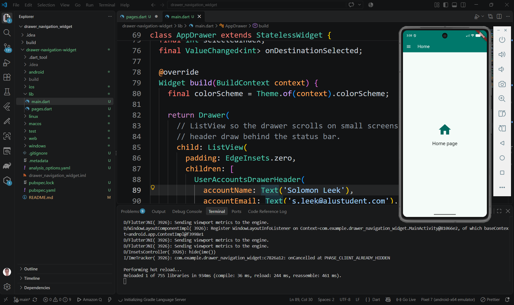
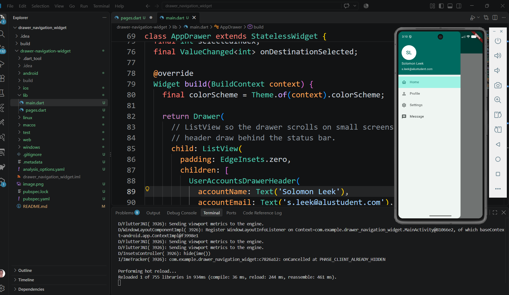
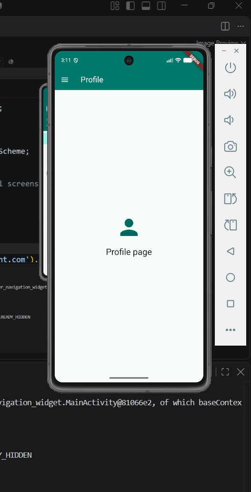

# Drawer Navigation Widget

A Flutter app that demonstrates `Drawer` — a side panel that slides in from the left and lets the user switch between pages.

## Run instructions

```
flutter pub get
flutter run
```

To run the widget test:

```
flutter test
```

## Three attributes demonstrated

| Attribute | What it does |
|---|---|
| `Scaffold.drawer` | Attaches the drawer to the screen. Flutter automatically adds the hamburger menu button to the AppBar and enables the swipe-from-the-edge gesture. Remove it and both disappear. |
| `ListView padding: EdgeInsets.zero` | Removes the default top padding inside the drawer so the `UserAccountsDrawerHeader` colour fills all the way behind the phone's status bar. Change it to `EdgeInsets.all(16)` to see the gap appear. |
| `ListTile selectedTileColor` | Sets the background colour of the currently active drawer item. Set to `colorScheme.primaryContainer` (light teal). Change it to `Colors.red` to see the highlight colour change immediately. |

## Screenshots







